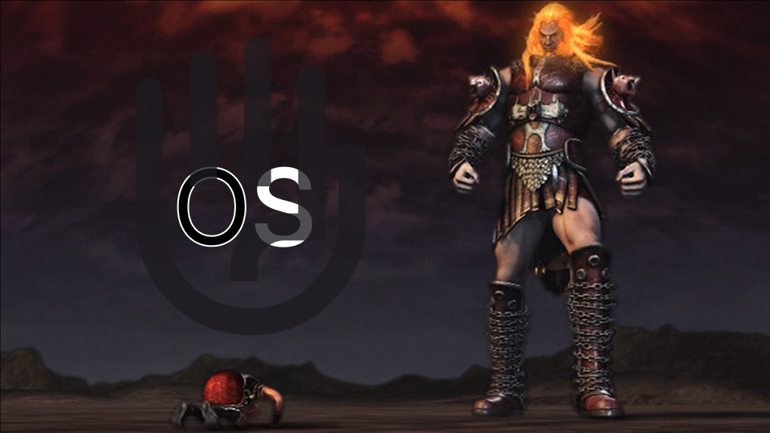

# InterupsiArOS
OS untuk manusia yang ingin berjuang di medan perang (nanti ditambahin lagi)

## Manusia Pencari Kebenaran
1. Dipta
2. Aqsha
3. Bagas
4. Sulthan

## Daftar Isi
1. [Cara Run](#cara-run)
2. [Pendahuluan (Wajib Baca)](#pendahuluan-wajib-baca)
3. [Chapter 0](#chapter-0)
4. [Chapter 1](#chapter-1)

## Cara Run
Mudah saja, jika ingin compile OS-nya cukup menggunakan command
```bash
make build
```
Perhatikan bahwa sudah tercipta file .iso dan beberapa file aneh lainnya somewhere in .iso, artinya compile-nya sukses (mungkin). Sekarang, anda bisa run OS-nya dengan command
```bash
make run
```
Selamat, InterupsiArOS berjalan!

## Pendahuluan (Wajib Baca)
Dunia ini penuh dengan kegelapan, kebodohan, dan kepengecutan. Nilai-nilai inheren yang tumbuh di jiwa manusia sejak eksistensi mereka dihembuskan oleh Prometheus, jiwa-jiwa pejuang yang haus akan kemenangan dan tak tergoyahkan sekalipun oleh kehancuran tempat tinggalnya dan jatuhnya jasad rekan sejati mereka di medan perang, telah hilang. Kini, manusia berada di titik terendah spesies mereka. Sekumpulan organisme yang seharusnya merupakan puncak rantai makanan dari segala makhluk yang pernah hidup di muka bumi telah kehilangan status mereka sebagai entitas terkuat di bawah para dewa-dewi, menjadi makhluk terhina, yang eksistensinya merupakan pengkhianatan terhadap para dewa-dewi itu sendiri.

Itulah kata-kata yang keluar dari mulut Ares, Sang Dewa Perang yang Bengis dan Haus akan Kemenangan, namun Bijak dan Pendorong Keberanian. Kata-kata tersebut bukanlah sebuah kekecewaan semata, melainkan sebuah frustrasi yang diakumulasi oleh sang Dewa sejak kejatuhan masyarakat Yunani. Kata-kata tersebut adalah peringatan yang nyata bagi umat manusia di seluruh dunia.

Kami, 4 Raja Pejuang Agung, adalah titisan para SPARTANS yang senantiasa berjuang demi bara api perjuangan yang menuntut akal yang menakar, hati yang merasa, serta perjalanan yang panjang di depan mata para pejuang sejati. Kami adalah representasi dari Ares yang akan membawa semangatnya ke dunia fana ini. Kami membutuhkan sesuatu, agar nilai-nilai Ares dapat tersampaikan secara luas. Oleh karena itu, tertulis secara mentah pada surat ini, kami mengorbankan segala darah, air mata, dan keringat dalam penciptaan sebuah mahakarya kami yang dapat menciptakan tether kompatibilitas bagi Ares di dunia yang hina ini serta menyambungkan titah-titah Ares pada sinapsis seluruh umat manusia di muka Bumi ini baik yang masih hidup maupun sudah tiada. Melalui InterupsiArOS, kami akan menghidupkan kembali jiwa-jiwa semangat perang dan urat keberanian manusia dan membawa mereka kembali ke medan perang kami, para SPARTANS.

Tidak ada ruang untuk kelemahan dan ketidaksiapan di sini. Yang akan hidup hanyalah mereka yang dapat beradaptasi, memiliki gairah dan kekuatan untuk mengekspansikan kekuasaan bagai ekspansi kofaktor pada sebuah operasi invers matriks, serta mereka yang mempersiapkan diri untuk perjalanan yang tidak pasti.

## Fitur yang Dibuat
### Chapter 0
1. **Kernel Code** (kernel.c)\
Penjelasan: Secara singkat, setelah bootloader mengeksekusi OS di RAM, source code kernel-entrypoint.s sebagai perantara (kata Gemini gak bisa langsung run kode C, harus asm dulu) akan melakukan set-up dan load Kernel Code sebagai main program dari si kernel ini. Ya, intinya ini main programnya.
2. **GDT** (gdt.h dan gdt.c)\
Penjelasan: GDT atau Global Descriptor Table adalah sebuah tabel yang berisi Segment Descriptors, di mana Segment Descriptor sendiri menyimpan informasi berupa flag mengenai suatu region di memory (misal ukuran segmennya, access level-nya, base offset, dll.). Entry GDT memuat Null, Kernel Code Segment, dan Kernel Data Segment (setidaknya untuk chapter 0, harusnya). GDTR menyimpan informasi terkait ukuran dan posisi GDT.
### Chapter 1
1. **Manipulasi Framebuffer (framebuffer.c, framebuffer.h)**\
Penjelasan: Framebuffer adalah sebuah buffer yang mengandung bitmap untuk melakukan display pada layar (singkatnya). Pada chapter 1, kita melakukan manipulasi framebuffer sederhana dengan framebuffer_write(), framebuffer_set_cursor(), dan framebuffer_clear(). Video mode VGA yang digunakan untuk OS ini by default adalah VGA Mode 3, yang menyediakan tampilan antarmuka teks dengan lebar 80 karakter dan tinggi/baris 25 karakter. framebuffer_write() digunakan untuk menuliskan karakter pada layar. framebuffer_set_cursor() digunakan untuk mengatur lokasi kursor pada teks. framebuffer_clear() digunakan untuk membersihkan framebuffer dan reset posisi kursor ke awal. Also ada portio untuk handle input/output ports.
2. **Interrupt** (interrupt.c, interrupt.h, idt.h, idt.c)\
Penjelasan: INTERUPSI ARESSS. Interrupt digunakan untuk memberi sinyal/notifikasi bagi CPU untuk menghentikan program yang sedang dijalankan sementara untuk mengerjakan suatu tugas lain. Jika keyboard akan memberikan sebuah input yang in turn akan memberikan sebuah output berupa teks yang di-display, maka keyboard memerlukan sebuah mekanisme yaitu hardware interrupt setiap kali keyboard ditekan untuk menjalankan proses tersebut. IDT, atau Interrupt Descriptor Table merupakan tabel yang memetakan nomor interrupt ke handler-nya. Disediakan juga intsetup.s sebagai entry point dari interrupt-nya. Abstraksi untuk interrupt handler dilakukan oleh interrupt.c.
3. **Keyboard Input** (keyboard.c)\
Penjelasan: Sesuai namanya, implementasi input dari keyboard dengan interrupt dan manipulasi framebuffer. Dilakukan mapping scan code keyboard ke ASCII. Keyboard ISR berfungsi sebagai bagian utama driver keyboard dan direpresentasikan dengan fungsi keyboard_isr() yang memproses pemetaan input dan pic ack. Serta ada beberapa fungi lainnya yang memanipulasi state dan data keyboard.

# ⒯⒪ ⒝⒠ ⒞⒪⒩⒯⒤⒩⒰⒠⒟